# CS2050 Project Report
# Molecular Dynamics Neighbor-List Performance Study

**Author:** Lucas Steinberger  
**Course:** CS2050  
**Date:** May 7, 2026

## Abstract

This project studies the performance of neighbor-list construction for a molecular-dynamics-style particle simulation. We compare serial, OpenMP, MPI, CUDA, and Julia implementations, focusing on how each method handles the same basic cutoff-based pair search. The main goal is not only to measure runtime, but also to understand which algorithmic and hardware choices matter most for strong and weak scaling.

## Introduction

At each timestep in a molecular dynamics simulation, forces must be calculated between all interacting atoms to update their velocities. These force calculations typically dominate runtime, and there are many force fields that offer different balances between accuracy and computational cost. In the simplest class of force fields, all interactions between atoms are calculated pairwise, ignoring many-body effects. Even in this simple case, the number of interactions between atoms is $O(N^2)$, which becomes expensive for large systems. To mitigate this cost, many simulations use a neighbor list to track which pairs of atoms are close enough to interact with non-negligible forces, and then calculate forces only for those pairs. The neighbor list is typically built with a cutoff distance larger than that of the force field, which allows it to be reused for multiple timesteps before needing to be rebuilt.

The algorithm of interest for this project is the construction of that neighbor list. In real MD simulations, the computation of a neighbor list may be more explicitly linked to the force calculations themselves, but for the purposes of this project we treat it as a standalone task. It is a highly parallel problem, and one that exhibits many, but not all, of the parallelization patterns relevant to full MD simulations, which makes it a good example algorithm for a final project.

## Algorithm Details

To be precise, a neighbor list for a frame of $N$ atoms is a list of pairs of atom indices $(i, j)$ such that the distance between atoms $i$ and $j$ is less than some cutoff radius $r_c$. This is sometimes also known as a pair list or edge list. The naive algorithm is simply to compute the distance between every pair of atoms and check whether it is less than $r_c$, which has $O(N^2)$ complexity. However, there is an easy structural optimization we can make to simplify the task: a neighbor list is inherently symmetrical, meaning that if $(i, j)$ is in the neighbor list, then so is $(j, i)$. To avoid computing and recording duplicate information, we modify the algorithm to compute only pairs where $i < j$, generating a so-called half neighbor list. This is still $O(N^2)$, but with a significantly smaller prefactor.

## Methods

For this project, I implemented the half neighbor list algorithm, or an appropriate modification of it, with a number of different frameworks:

- Serial C++ (baseline)
- OpenMP (thread-level parallelism)
- MPI (process-level parallelism)
- CUDA (GPU acceleration)
- Julia (bonus)

Rather than present all these methods at once and later cover results, I think it is a clearer story to describe each method and present its results simultaneously, while calling back to previous methods for comparison and context.

### The Serial Algorithm

The serial code is simple, but it sets the groundwork upon which the other methods are built. It reads in a frame of $N$ atoms, which comes in an `extxyz` format. This is a standard format for MD simulations, and contains the coordinates of each atom in 3D space, as well as the dimensions of the simulation box and periodicity flags for each axis. The serial code then computes the half neighbor list by iterating over all pairs of atoms, computing their distance, and checking whether it is less than the cutoff radius $r_c$. There are two details to note. First, we compute the distance squared and compare it with the cutoff squared to avoid unnecessary square-root calculations. Second, we apply the minimum image convention to account for periodic boundary conditions. Essentially, this means that we imagine our simulation box is surrounded by infinite periodic images of itself, and when computing the distance between two atoms $(i, j)$, we consider the shortest vector connecting two instances of them in the infinite periodic system. In this implementation, periodicity can be customized on a per-axis basis, but in every test case periodicity is enabled in all three dimensions, with a cubic box.

To benchmark the serial model, we calculate the runtime of the neighbor-list construction for a range of atom counts $N$ and a fixed cutoff radius $r_c$. Importantly, we scale the box volume with $N$ to maintain a constant density of atoms in the box, which seemed to be the fairest way to compare runtimes across different problem sizes. Below, we show the isolated time to build the neighbor list for a range of $N$ from $10^2$ to $10^6$ atoms, with an initial box side length of 50 units at the smallest size and a cutoff radius of 10 units. This mostly serves as a sanity check on the runtime of the algorithm, and we indeed capture near-perfect $O(N^2)$ scaling, as expected.

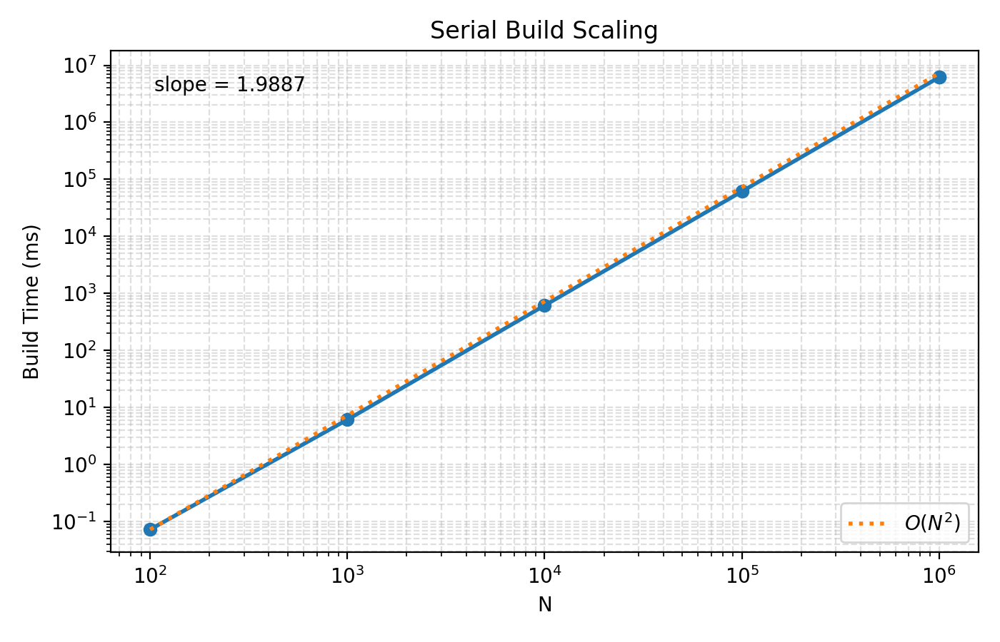

We also establish a couple of conventions for the rest of the experiment. First, for benchmark runs, we do not bother to write the neighbor list to disk, as this is not a necessary part of the algorithm and would only add noise to our timing results. We used writing to disk only for testing and validation. Second, a number of backend implementation details are decided in the serial code. For example, the serial code introduces the core data classes `EdgeList` and `Frame`, which are used to store the neighbor list and the input frame data, respectively, and follow certain conventions. In particular, `Frame` stores the coordinates in an array-of-structures (AoS) layout, which becomes relevant later in the CUDA implementation.

### OpenMP

The OpenMP version largely follows the same structure as the serial code, but parallelizes the outer loop over atoms $i$ with OpenMP. There is, however, one caveat to the implementation: naively parallelizing the outer loop and writing to a shared neighbor list would introduce a race condition, as multiple threads could attempt to write to the neighbor list at the same time. A simple but inefficient solution to this problem would be to use a critical section to prevent such race conditions, but this would be a significant bottleneck. Instead, we have each thread write to a private neighbor list and then concatenate the results at the end. This also preserves the order of the neighbor list, which avoids sorting it after the fact.

For benchmarks, we test both strong and weak scaling with the same range of $N$ and cutoff radius as the serial code, and we test a range of OpenMP thread counts as powers of 2, up to 16. For strong scaling, we fix $N$ at $10^5$ atoms, and for weak scaling, we scale $N$ and the box dimensions with the number of threads to maintain a constant number of atoms per thread. For strong scaling, we plot speedup, which is defined as $S = T_1 / T_p$, where $T_1$ is the runtime of the serial code and $T_p$ is the runtime with $p$ threads. For weak scaling, we plot efficiency, defined as $E = S(p) / p$, where $S(p)$ is the speedup at $p$ threads. Note that, in contrast to the serial plot above, here we use the total runtime, which includes setup and overhead, rather than just the build time, as we are interested in the overall performance of the parallel code.

| OpenMP strong scaling | OpenMP weak scaling |
| --- | --- |
| 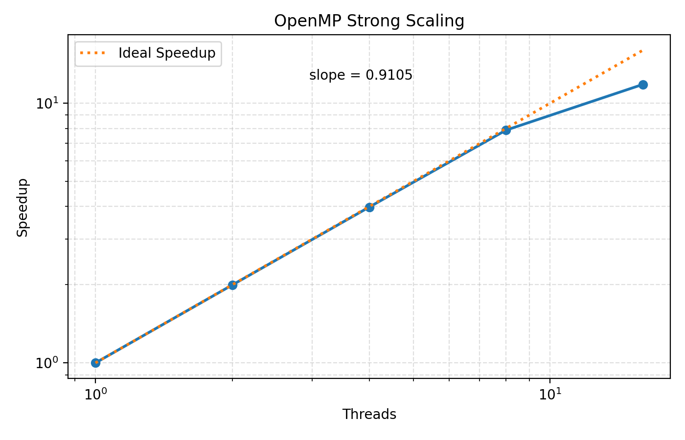 | 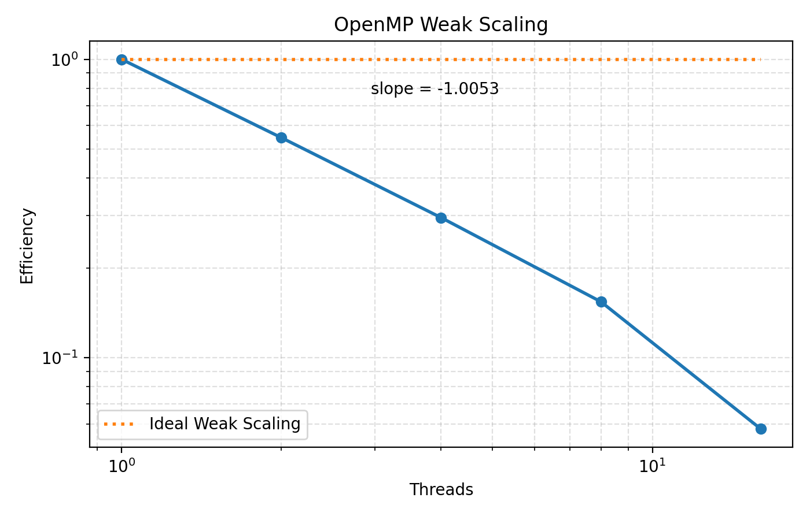 |

The plots show near-perfect strong scaling up to 8 threads, with some dropoff at 16 threads. The weak scaling, on the other hand, shows a steady drop in efficiency as the number of threads increases. It is hard to say exactly what causes these trends, but my guess is that the strong scaling likely hides a hard memory bandwidth limit at a given size, and the weak scaling tests are showing the effect of considerable overhead for managing the threads themselves.

### MPI

The MPI implementation is perhaps the most interesting, and provides the most insight into the challenges faced in a true MD simulation. The shift from a shared-memory to a message-passing framework leads us to use a domain decomposition approach, where we divide the simulation box into subdomains and assign each subdomain to a different MPI rank. Each rank is responsible for building the private neighbor list for the atoms in its subdomain. What makes MPI interesting is that the neighbor-list construction is not a purely local operation, as atoms near the boundary of a subdomain may have neighbors in adjacent subdomains. To account for this, we need to perform a halo exchange, where each rank sends the coordinates of its boundary atoms to its neighboring ranks. Doing this correctly requires careful handling of atom ownership and the message-passing scheme. In our system, each rank is responsible only for the source atoms within its domain, and maintains a separate buffer for the halo atoms received from neighboring ranks. The algorithm for building the halos themselves is pretty clever. To begin, each rank exchanges boundary atoms with its neighbors along one axis. This process is repeated, but crucially, ranks send their halo atoms as well. This allows halo atoms to make it into neighbors that do not share a face with the original rank, such as corner neighbors in 3D.

It is worth noting that this domain decomposition can be considered a fundamentally different algorithm from the serial and OpenMP versions. Technically, the truest comparison of algorithms would be to have each rank see the whole simulation and only be responsible for some fraction of the neighbor list. However, since this would likely just be a worse version of OpenMP, and because it does not really shed any new light on the problem, I opted for the domain decomposition approach, which is much more relevant to real MD simulations. This fundamental difference in algorithms shows up in the benchmarks and requires careful interpretation.

For MPI, we benchmark strong and weak scaling similarly to OpenMP, this time treating $N$ as the number of ranks, not threads. For the sake of comparison, we have each rank do its work in series, although both conceptually and in implementation, it is very simple to have each rank use OpenMP to parallelize its local neighbor-list construction. The strong-scaling benchmark at first seems impossible: we achieve speedups greater than the "ideal" speedup of $S = N$, in what appears to be a clear violation of Amdahl's law. However, this is not a bug. Rather, as the number of ranks increases, the size of the local domain, and thus the total number of edges to check, decreases, which leads to a superlinear speedup. In other words, via domain decomposition, the total work required has actually decreased, which is what allows us to beat ideal scaling. This feels counterintuitive, because the number of total atoms is the same, but the number of pairs that need to be checked is not.

We also see significantly better weak scaling than OpenMP, which is likely due to the same effect, and not because of any difference in the communication overhead between the two methods. In fact, the communication overhead for MPI is likely much higher than the thread-management overhead for OpenMP, but this is hidden by the fact that the total work is decreasing as we add more ranks.

| MPI strong scaling | MPI weak scaling |
| --- | --- |
| 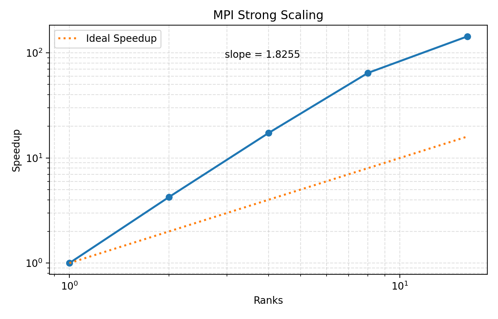 | 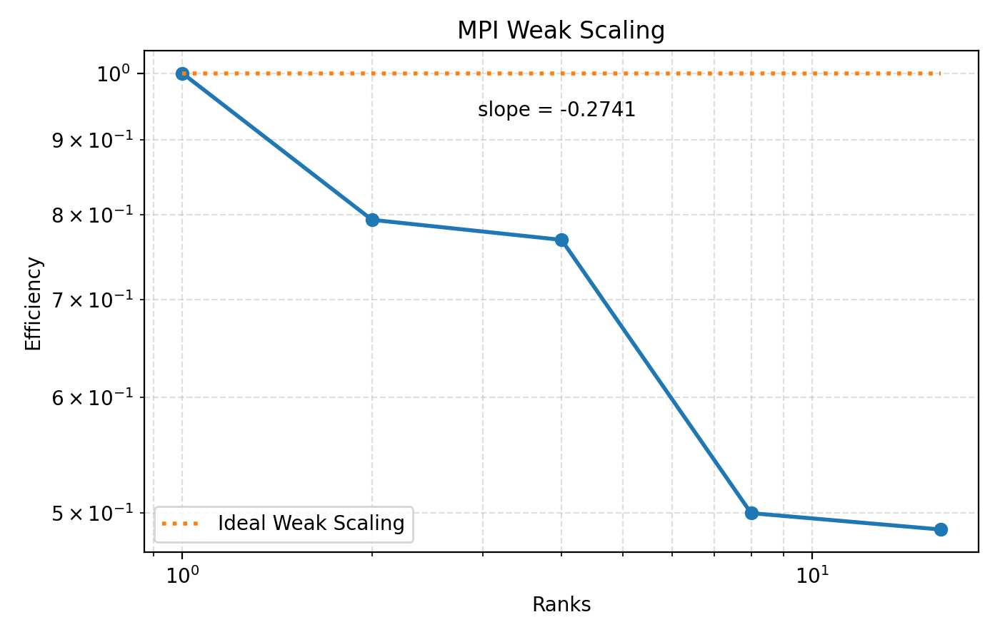 |

From an implementation perspective, I would note that MPI was a little challenging to make work on the cluster, particularly because it is so sensitive to the environment from which a Slurm script is launched.

### CUDA

The CUDA implementation returns to the original algorithm, where each thread is responsible for a single source atom and checks all possible neighbors for that atom, with no domain decomposition. However, the nature of GPU computing and the challenge of managing memory between CPU and GPU lead to a couple of implementation changes worth noting. First, in our previous methods, we stored the `Frame` object as an array of structures (AoS), where each atom's coordinates are stored together in memory. This is semantically easy to follow and fine for the CPU, where memory access patterns are not as critical, but for the GPU we switch to a structure-of-arrays (SoA) layout, where the `x`, `y`, and `z` coordinates of all atoms are stored in separate arrays. This allows for coalesced memory access on the GPU, which significantly improves performance.

The second detail is that we do not know a priori the actual length of each atom's private neighbor list. Naively, we might do one pass through the source atoms and add matching pairs to private neighbor-list buffers as we go. But this would require repeatedly reallocating new space on the GPU for each new edge, which would be very expensive. Instead, we use a two-pass approach. In the first pass, we do the same work as the serial code, but rather than writing the edges to a neighbor list, we simply count the number of neighbors for each source atom. This allows us to allocate exactly the right amount of memory for each atom's neighbor list on the GPU. In the second pass, we do the same work again, but this time we write the edges to the preallocated neighbor-list buffers. While it seems wasteful to do the same work twice, it is actually much more efficient than the alternative of dynamic memory allocation on the GPU.

However, we did run into an implementation detail that was annoying to overcome. In order to know how and where to allocate memory for the neighbor lists, we need to do a prefix sum, or scan, to determine the offsets and starting points for each atom's neighbor list in the larger buffer. After much effort, I was unable to get Thrust to work on the GPU, and had to instead transfer the counts back to the CPU, do the prefix sum on the CPU, and then transfer the offsets back to the GPU. This is not ideal, and definitely adds some overhead, but because the counts are just a single integer per atom, the data transfer is not too bad, and it was the only way I could get the code working in a reasonable timeframe.

To benchmark, because there is no number of threads or ranks to modulate for weak and strong scaling, we perform a simple problem-size scaling like we did for the serial code, and compare the runtime to the serial code to see speedup. Our initial run with our first iteration of CUDA code is plotted below, in comparison to the serial code. Note that we plot the total time, not just the build time, to compare overhead fairly.

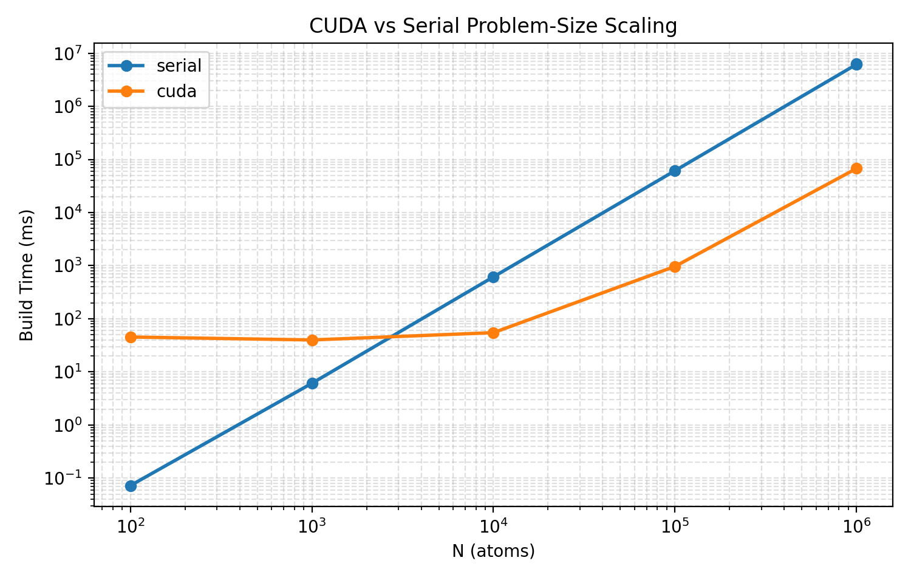

As expected, for small problem sizes, the CUDA code performs worse than the serial code due to overhead, but as the problem size increases, we see a significant speedup, with the crossover point around $N = 10^4$ atoms. For the largest problem size of $N = 10^6$ atoms, we see a speedup of around 100x compared to the serial code.

In order to see if we could push performance any further, we used NVIDIA Nsight Systems and Nsight Compute to profile our code. First, we used Systems to profile the entire CPU-GPU pipeline on a problem size of $N = 10^5$ atoms. We found that the vast majority of the time on the CPU was spent waiting on CUDA to compute the neighbor list, and not on CUDA memory allocations. This implied that, at a system level, we were largely compute-bound rather than memory-bound. We also found nearly equal time spent on each of our two kernels, the count and fill kernels, which makes sense since they do essentially the same thing.

The next step was to use Nsight Compute to profile the kernels themselves and see if we could identify any bottlenecks or inefficiencies. A roofline model plot, shown below, confirmed that our kernels were largely compute-bound across L1, L2, and DRAM. By far the largest proposed speedup was the following:

> The ratio of peak float (fp32) to double (fp64) performance on this device is 64:1. The workload achieved 0% of this device's fp32 peak performance and 22% of its fp64 peak performance. If Compute Workload Analysis determines that this workload is fp64 bound, consider using 32-bit precision floating point operations to improve its performance.

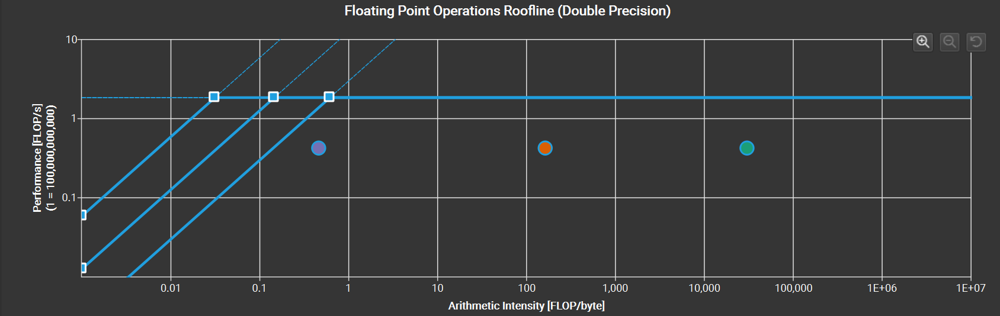

Traditional MD is double precision. This is largely true because of the long timescales involved, which can lead to significant error accumulation if single precision is used. However, modern MD will often use mixed precision, where the neighbor-list construction and force calculations are done in single precision. This makes it reasonable for us to try switching to single precision for our neighbor-list construction and see if we can get a significant speedup. We note that it would not be fair to compare single-precision GPU code to double-precision CPU code, but rather that this is an interesting test to run within the CUDA framework. We implemented a single-precision version of our CUDA code and indeed found that it was significantly faster than the double-precision version, as shown below.

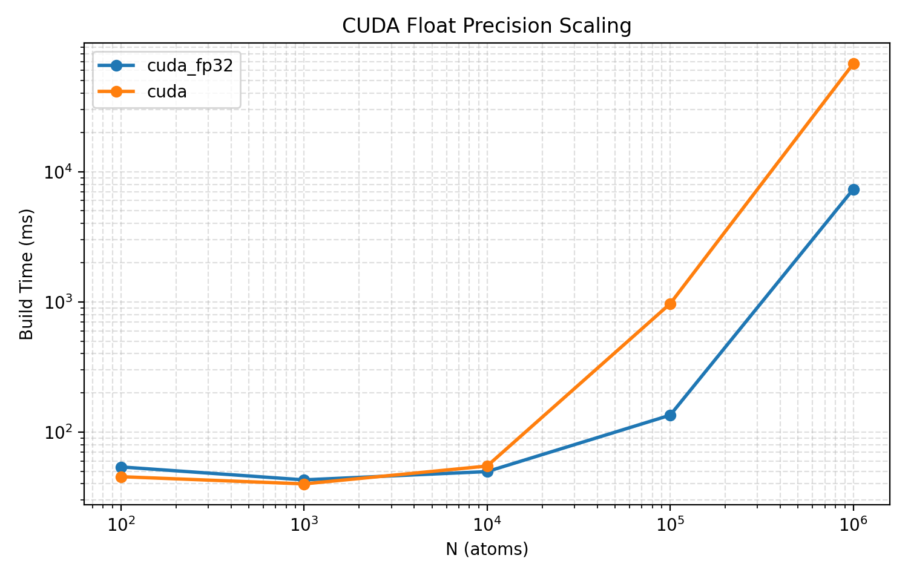

### Julia

The last paradigm we test is Julia, which is a high-level language that aims to provide the ease of use of Python with the performance of C++. We implemented a version of the neighbor-list construction in Julia, using its built-in multi-threading capabilities for parallelism. The Julia implementation is most comparable to the OpenMP version, as it uses a similar shared-memory parallelism model. We benchmarked the Julia code in the same way as the OpenMP code, testing strong and weak scaling with a range of thread counts.

We found that in our range of thread counts, Julia was consistently slower than the OpenMP version. We also found that Julia has significantly worse strong scaling than OpenMP, but better weak scaling. The strength of Julia really came in the programming experience. While I did not have much experience with Julia in the first place, I could easily see how, once you get past the initial learning curve, writing parallel code could feel like writing Python code, which is certainly what I am more used to and seems to be the direction that many scientific programmers are moving toward.

| Julia strong scaling | Julia weak scaling |
| --- | --- |
| 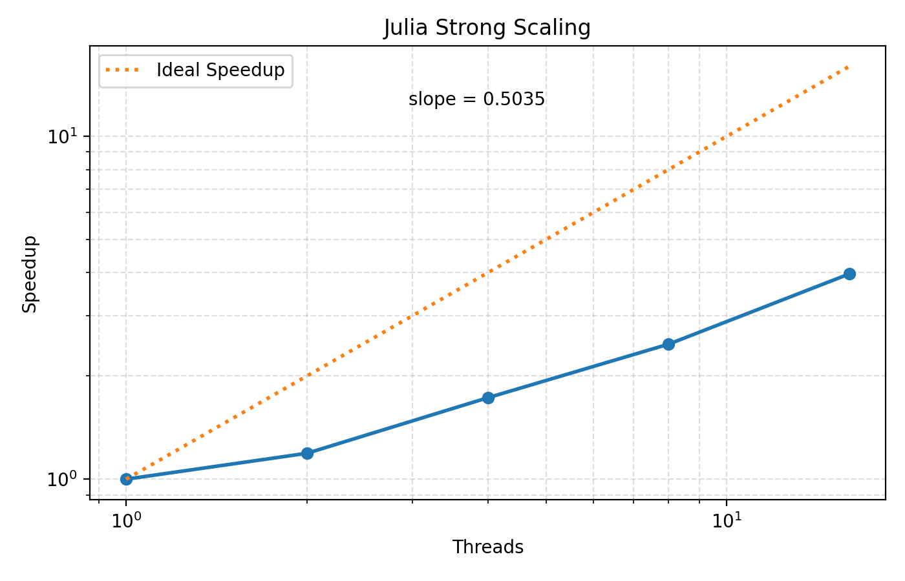 | 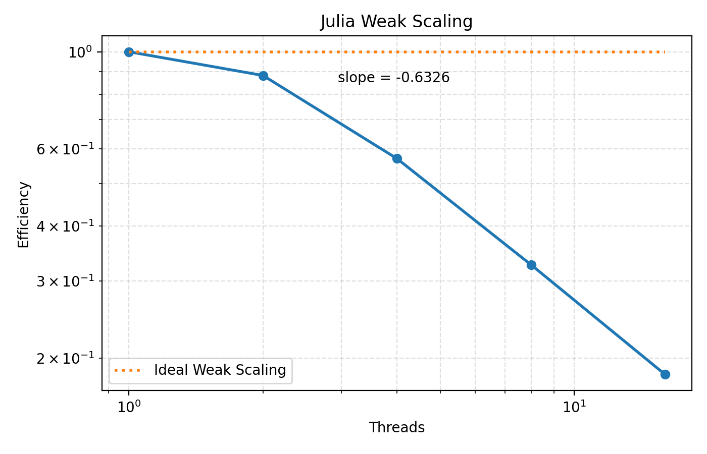 |

| OpenMP vs. Julia total runtime |
| --- |
| 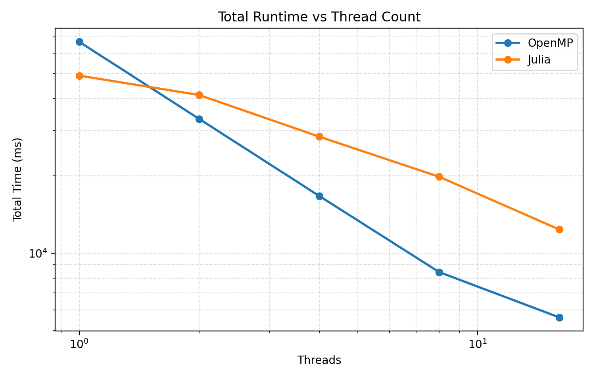 |

## Conclusion

This project felt like a good test case for practicing parallel code and for gaining experience and perspective on the challenges of different frameworks. In particular, I have three primary takeaways:

1. Design code from the very beginning with parallelism in mind. Top-down design is even more important in parallel code, and in particular, it seems important to consider what data structures you want to use for the parallel section of the code, then build up the rest of the codebase around that section. This often means starting not at the front end of an algorithm, but somewhere in the middle.
2. Choice of parallelism and choice of algorithm are not entirely separate. Different parallel frameworks often lend themselves more naturally to different algorithms, and it is important to be flexible with your algorithm when considering the tools available to you.
3. CUDA is hard. This may not be surprising, but I found that reasoning about CUDA code, using the CUDA libraries, and debugging CUDA code were all significantly more difficult than normal code, and in general required a much higher mental bandwidth to follow how memory is moved and communicated throughout the program. This highlights the value of high-level frameworks and the work that NVIDIA does to provide good abstractions for GPU programming, and it makes me appreciate the difficulty of that work even more.

Overall, I came away from this project with a much better feel for the parallel coding workflow, and with a gratitude that in most work and research, someone else has already done this hard work for me. Indeed, this class as a whole has not made me want to be a parallel programming engineer, but it has given me a valuable understanding and appreciation for the tools that computer scientists make for the rest of the scientific computing community.
